# 🌱 My Habit Tracker

A simple yet powerful **habit tracking app** built with Flutter and Firebase.  
This app helps you build better routines, stay consistent, and stay motivated with daily quotes.

---

## ✨ Features

- **User Authentication**
  - Sign up, login, and logout with Firebase Authentication.
  - Securely store habits and personal data in Firestore.

- **Habit Management**
  - Add, edit, and delete habits easily.
  - Set frequency: daily, weekly, or custom weekdays.
  - Track daily completions with a simple tap.

- **Motivational Quotes**
  - Get a new inspirational quote every day.
  - Save your favourite quotes for later.
  - Dedicated screen to view all favourite quotes.

- **Progress Tracking**
  - View your habit streaks and completion history.
  - Calendar-based overview to visualize progress.
  - Success rate statistics to measure growth.
  - **Habit Progress Page:** View your habits in **weekly** or **monthly** chart formats.

- **Category Management**
  - Predefined categories: **Health, Study, Fitness, Productivity, Mental Health**.
  - Users can add their own custom categories anytime.
  - Filter habits by category to see what needs to be completed today.

- **Task List**
  - Clean habit cards displaying:
    - Current streak
    - Weekly/daily frequency
    - Category tags
  - Easy-to-read layout for quick habit tracking.

- **Profile Management**
  - Edit profile information (name, gender, birthday).
  - Validations:
    - Name must be at least 3 characters.
    - Birthday cannot be a future date.
    - Timezone validation for accurate logs.
  - Logout option conveniently placed at the bottom.

- **UI/UX**
  - Clean Material UI with Flutter.
  - Confirmation dialogs for deletions.
  - Smooth navigation and responsive layout.

---

## 🛠️ Tech Stack

- **Frontend:** Flutter (Dart)
- **Backend:** Firebase Firestore
- **Authentication:** Firebase Auth
- **State Management:** Provider
- **Other Tools:** Intl, Cloud Firestore, Material Design

---

## 💾 Data Storage / Technical Information

The app uses **Firebase Firestore** to store all user and habit-related data. The structure is organized for simplicity and scalability:

- **User Information**
  - Stored under: `users/{userId}/`
  - Contains personal details like name, gender, birthday, timezone, and profile settings.

- **Habits Information**
  - Stored under: `users/habits/{habitId}`
  - Each habit contains:
    - Title, description
    - Category
    - Frequency (daily/weekly/custom)
    - Current streak and history of completions

- **Categories**
  - Stored under: `users/settings/preferences`
  - Maintains a **string array of categories**, including predefined ones and any custom categories added by the user.

This structure ensures easy retrieval and filtering of habits, efficient tracking of progress, and flexible category management.

---

## 📸 Screenshots & Demo

Here are some screenshots from the app:

### Screenshots in Light Mode
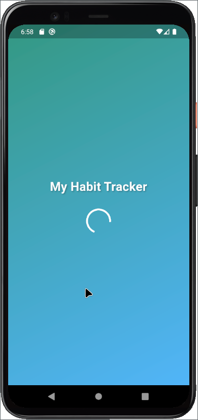  
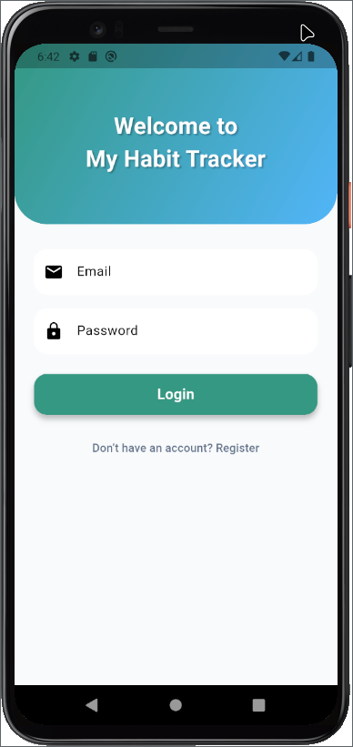
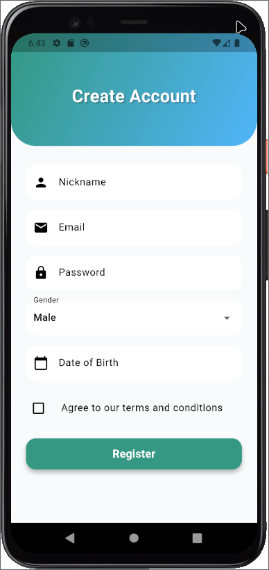
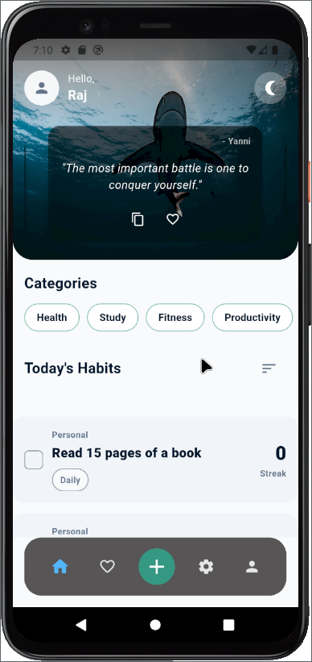 
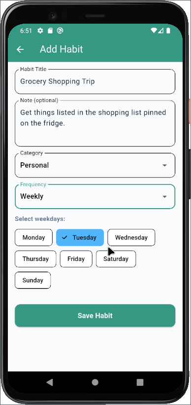 
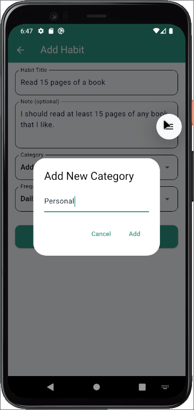
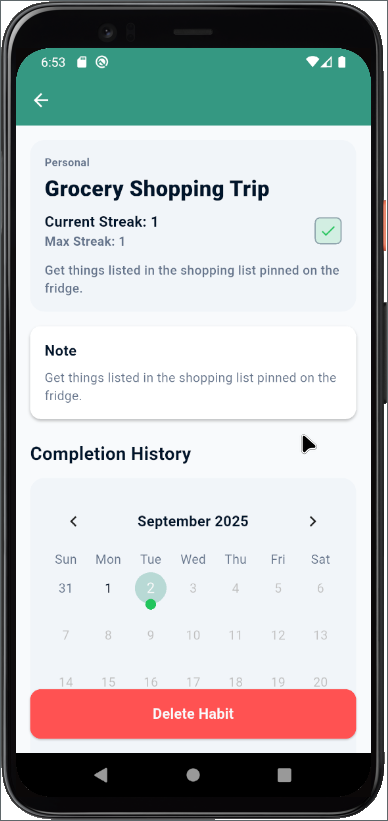 
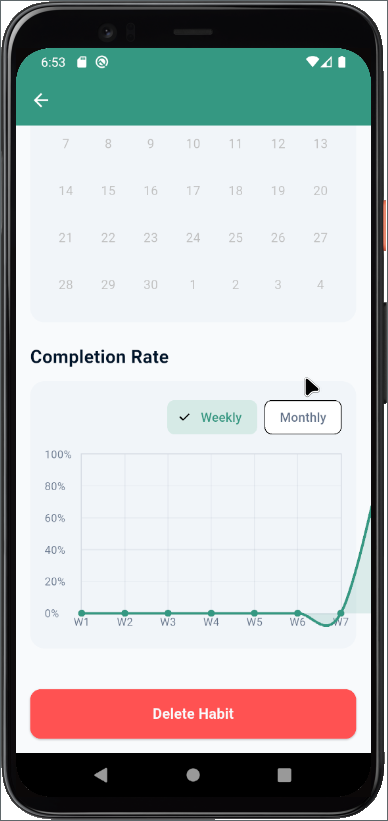
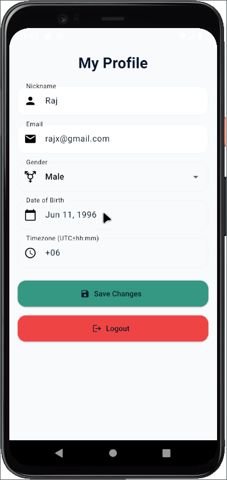
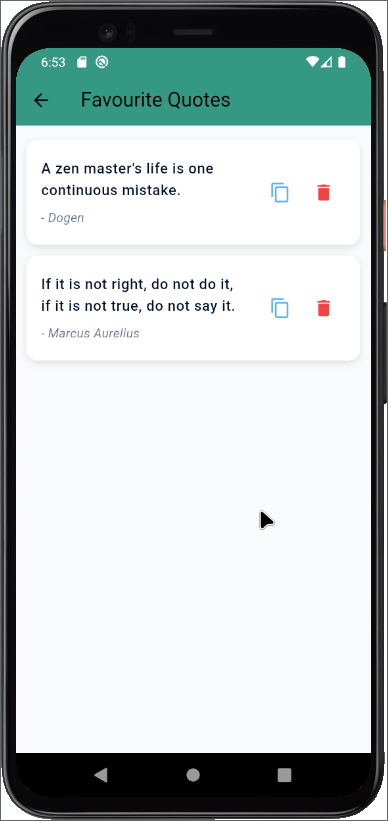 
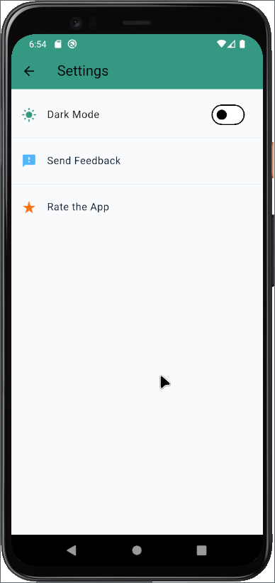 

### Screenshots in Dark Mode 
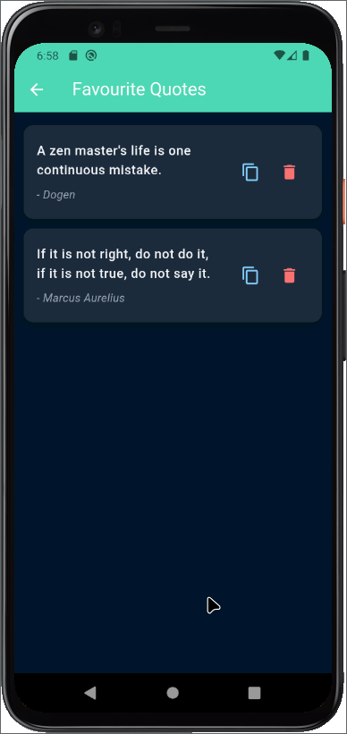 
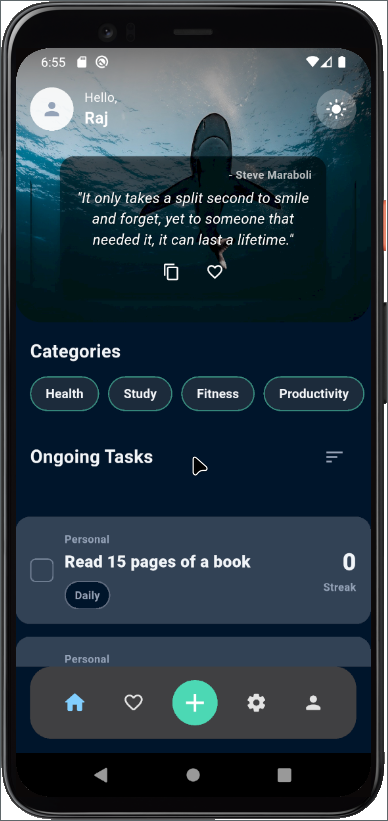
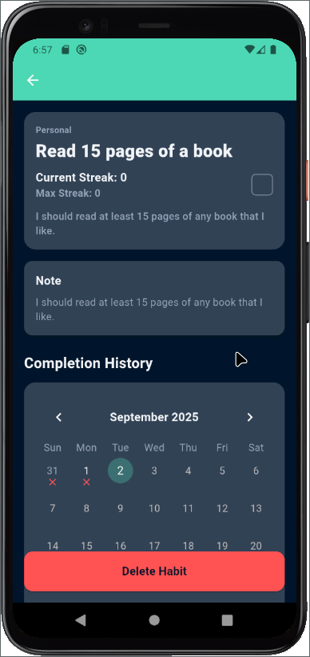 
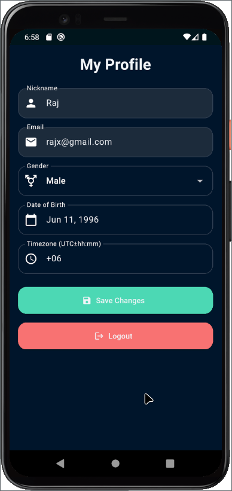


### Demo Video
[Watch Demo](https://your-demo-video-link.com)

---

## 🚀 Getting Started

### Prerequisites
- Install [Flutter](https://docs.flutter.dev/get-started/install) (latest stable).
- Set up a Firebase project and enable:
  - Firestore Database
  - Firebase Authentication (Email/Password)

### Installation

```bash
# Clone the repository
git clone https://github.com/your-username/habit-tracker-app.git

# Navigate to the project folder
cd habit-tracker-app

# Install dependencies
flutter pub get

# Run the app
flutter run
